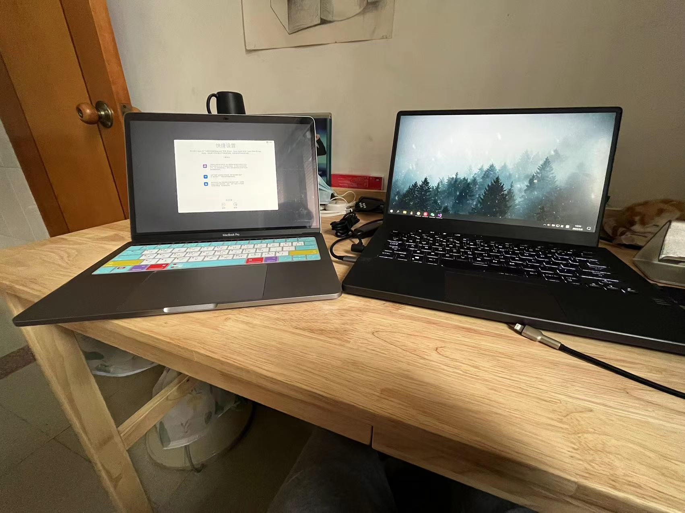
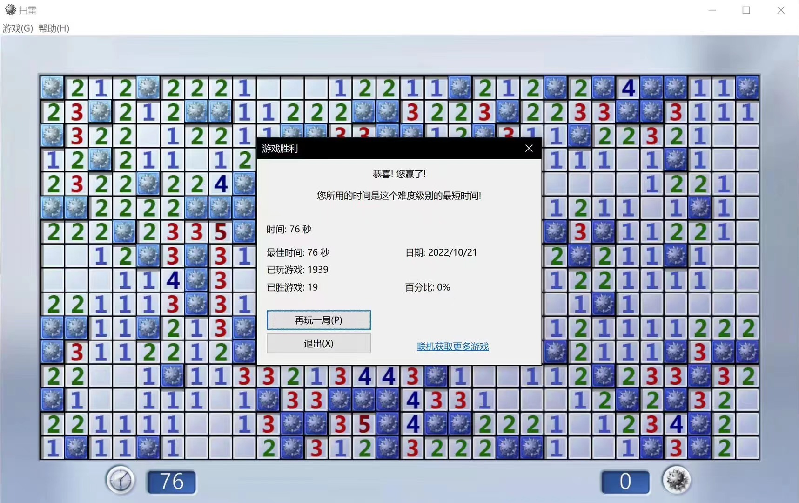

# 专业所需的硬件设备

基于本人在上学的这二年期间花了一点小小的冤枉钱来购置电脑这个背景，我决定新加一part来讲一讲电脑的选择，我是一个Windows + Mac双持用户，同时因为专业原因也在自己的设备上装了Linux操作系统，关于电脑的选择，我直接分为Windows系电脑和苹果系电脑来谈谈：

<figure><figcaption>
我的两个家伙
</figcaption></figure>

### Windows系电脑

Windows电脑的选择需要根据使用场景进行划分，作为CST专业学生的电脑，我猜有的同学会觉得我们需要一台性能很强劲的笔电来支撑起我们的学习工作，但事实上，本专业的课程基本上很少有能触碰到电脑性能高峰的场景

计科专业的敲代码用不着高性能，而跑课程级的玩具代码也不会让你的电脑感到压力骤增。真正的重头戏比如近年来大火的机器学习、深度学习方向，需要大量的显卡(GPU)进行计算的场景，用个人电脑的小身板也撑不起多大规模的模型训练，甚至于现在的这种模型训练之类的工作都是部署到远程的服务器上的，个人电脑只是作为一个交互的终端让我们进行操作，所以大家并不需要因为专业的原因而去追求非常高配置的电脑

但是撇开专业原因，需要高性能的场景还有：

* 游戏，大伙都喜欢游戏🤤
* 专业软件，如你要做视频剪辑、搞直播等😎
* 多开n个窗口，也许你会在浏览器中打开几十上百个窗口🤯

那么，对于游戏而言，你得明确自己的游戏类型：如果你只是玩**一般网游**(像我一样打CF、开LOL、玩联机Minecraft~~或者Genshin Impact~~之类的)，这些游戏的要求并不高，十年前的电脑都能畅玩的级别，你就去当前比较主流的全能本的电脑里做选择就行了；而如果你是一个硬核一点的玩家，你喜欢**新的网游**、玩**3A单机**(比如Apex，像我一样偶尔上地平线5飙车)，那你就得看看游戏本了，但是你也要考虑到，游戏本的重量也是你出门的一大阻碍，甚至还有那块大黑砖充电器(建议搞个pd100w左右的充电器备着出门用)，所以自己也得斟酌一下

而对于后两个高性能场景的需求，视频剪辑搞直播之类的对CPU的性能有较高的要求，同时与后面的多开窗口一样，这些需求更偏向于你的电脑有足够大的运行内存，所以对CPU需要高性能的请移步全能本和游戏本领域，对于运行内存有要求的请观察电脑的拓展性，一般出厂16G运行内存都是够用的，再往上涨请自行/找维修点更换内存条

对于性能没有很高要求的同学，轻薄本我其实也是推荐的，想带去哪带去哪也是一种快乐，而且一般来说续航也会比上述的全能本和游戏本更优秀，同时你会获得禅模式😇，专注于你的计算机学习，反正你也没啥游戏玩了(虽然你可以扫扫雷，这是一个具有成瘾性的游戏)

<figure><figcaption>
<del>已经不用动脑了，鼠标一直点就会上瘾</del>
</figcaption></figure>

最后关于刚刚所说的 **轻薄本**、**全能本**、**游戏本** 三个类型的笔记本的选择可以移步公众号：笔吧评测室，点开[笔记本电脑选购指南](https://mp.weixin.qq.com/s/EvRhVBKdKfvQFM45DP7\_Vg)即可以看到不同价位下的电脑推荐，多看几篇还能学一学计算机导论的硬件部分【

### Mac/苹果系电脑

购买一台Macbook这件事是我大一上寒假突发奇想整的，在2022年整了一台Macbook Pro 2017 i5的老古董，结果用起来还挺欢乐的，大一下结束之后又卖了它，换成了Macbook Air 2020 M1，~~结果更喜欢这玩意了，因此戒掉了扫雷~~，但是我认为在你没有一台可以应急用的Windows本子的时候，搞一台Mac并不是一个好的选择，因为：

* MacOS下的各种环境配置资料会更难获取(Windows下你踩到的坑一般来说都有更多人替你趟过)
* 自2020年起，Mac的笔记本阵营转向以ARM架构为基础的CPU架构，ARM架构的CPU广泛用于手机等便携式设备中，但与我们当前绝大多数的个人电脑不同，个人电脑的主要CPU还是Intel和AMD两家采用的X86-64架构，这就会造成一些老软件无法在新的Mac上安装运行。到目前为止，我遇到过的软件问题不多但还是存在以下的例子：
  * 计算机组成原理的汇编代码实验课，其中的一个软件无法正常运行，但可以通过使用实验室机房的电脑完成(具有Windows和Linux双系统的机房电脑)
  * 大学物理的绘图拟合曲线软件没有macOS版本，需要另寻平替或尝试安装Windows虚拟机解决？我装了LabPlot来代替那个软件，至于Windows虚拟机的解决方案我还没有试过
* Mac的内存和硬盘比黄金还要贵，Air起步8G，再加8G要1500圆，可以说你要让它看起来像Windows笔记本，选个16G运行内存+512G的硬盘的版本将会轻易地让它成为一台万元本

那为什么我选择了这玩意呢，它肯定得有一些优点：

* 首先它特别轻(指13寸版本的Air或Pro)，完美的轻薄本
* 其次它续航特别恐怖，前面提到ARM架构广泛用于便携式设备，这让现在的Mac虽然有着电脑壳但续航跟平板电脑一样坚挺，属于出门用一整天不需要带充电器的水准，当然充电器也非常小，30W的手机充电器头都可以给他充电
* 同样的，这玩意不需要鼠标，触控板比鼠标好使，出门也不用带了
* MacOS是基于Unix魔改而来的系统，和Linux有一点亲戚关系，所以有些需要在Linux上做的事情用macOS上是可以直接完成的
* 我是个果子全家桶，耳机直接无缝切换，手机电脑共享剪切板，也是令人愉悦的一种体验

总而言之，买Mac请做好某些软件需要自己折腾平替方式的准备，这是一类很有意思也很优秀的笔记本，但它的长板很长，短板也很短，计科专业慎选，对工业软件有要求的理工科不要选，臭打游戏的也不要选，，基本在搞办公套件(office/WPS)的计算机弱相关专业有马尼随便选【

