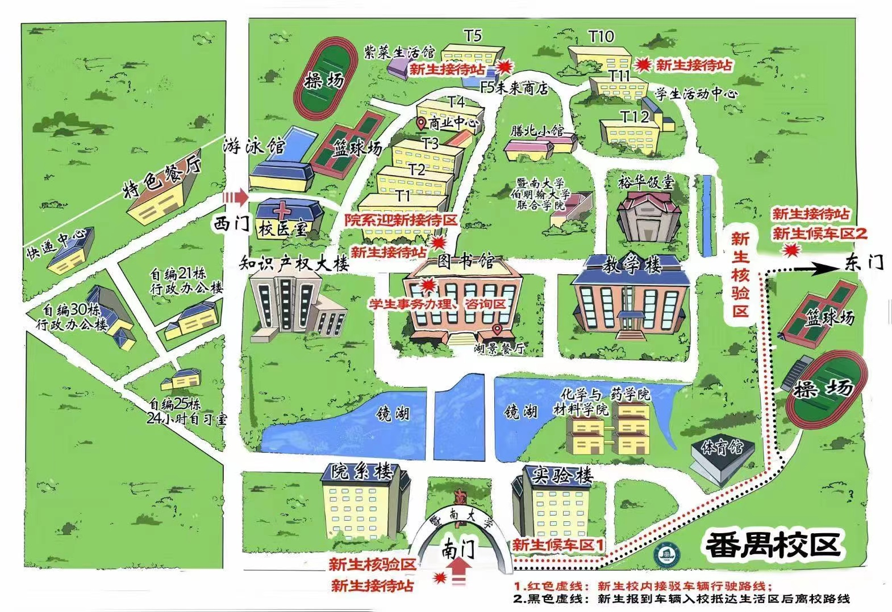

# 2. 🥵军训/新训相关

### 2.1 军训/新训内容

新生需要参与为期14天的[新生训练营/军训](https://mp.weixin.qq.com/s/eJPvT1Iv8IqmO7w14zRjdw)不一定14天全满，如果下雨了就在宿舍美美玩玩电脑开开黑，其中**内招生**必须参与军训，**外招生**可选参与新训/军训，在这里先放一张番禺校区的地图给大家

_其中红色的标记可以无视，今年不一定长这样，从我入学的时候紫菜生活馆已经废弃了_

_再补充：N是教学楼——N114就是教学楼的教室，W2是学生活动中心，虽然我也不知道为什么这么叫_)

<figure><figcaption>
南校区地图
</figcaption></figure>

对于**新训**来说，就是教大家打[暨南拳](https://www.bilibili.com/video/BV1y4411B7W7?share\_source=copy\_web\&vd\_source=2e2bcfa887bf8da9bde84af9fe79f8eb)啦，会有学姐学长作为教官手把手教你们，如果有身体不适的情况，需要提供疾病证明即可免训，但是还是得去对应场地看其他人学暨南拳，这里要注意**新训**与军训不同，大家统一的穿着是开学时发给大家的那件**短袖**的级服和长裤，所以大家最好准备好**防晒霜/防晒喷雾**，~~避免双手变成黑炭~~，认认真真打完拳之后学长学姐也有可能带你们联谊团建，14 天内可以和班里的同学进一步熟悉，最后在早上会有一次汇演

然后对于**军训**来说，上一年军训的集合地点是在东操场，基于今年学校里引进了美团的小黄车，从宿舍快速地赶到东操场应该不是什么大问题，但是还是要提醒大家赶路之前先检查好自己地军训全装有没有都带全：**帽子、腰带、肩章、小马扎以及你的水杯**，军训的服装是从头武装到脚的，因此连鞋子也要穿军训前买的那双胶鞋(_脚感很烂但不得不穿_)，~~不要因为丢三落四被教官抓出来当场处刑而丧失四年择偶权~~

下面列举军训的不同阵营：

* 普通方阵：军训的训练内容就是老传统的几样：**立正、稍息、看齐、整理着装、正步走、跑步走、敬礼还有最后的手语操**，还有一些穿插在其中但最后不做展示的拉歌、蹲姿之类的练习。
* 病号连(~~飞虎队~~)：身体不适的可以申请加入，集合后只需要参与**拉歌与手语操**练习就行了
* 擒敌拳方阵：我记不太清加入这个的方式了，他们就是练习他们方阵名字代表的那些东西，最后展示的内容也是他们自己的训练内容
* 匕首操方阵：同擒敌拳方阵，这两种方阵各自只有自己的一个方阵
* 国旗班：有专门负责这个班的教官会在军训中期过来各大方阵挑人去组成国旗班，一般都是军姿做得不错而且身高体型符合要求的学生被挑走，然后就是各种抗国旗走正步的练习，他们好像也是唯一的能多摸两下模型枪的单位，但也是训练最辛苦的阵营……

你的军训体验取决于几个方面：**你自己的态度、跟你同一个方阵的其他同学的表现and你教官的态度**(_好的教官带大家摸鱼最后还能拿个优秀连，恶心一点的教官没事挑点刺就可以罚罚大家多晒会太阳并且把你的脚给蹲麻_)，这几个方面差一点军训体验便会大幅下降，所以这件事大家就听天由命，保持**积极乐观向上**的心态就好了

最后再强调一下，不管大家有没有吃早餐，强烈建议大家带**葡萄糖水**，超市有卖冲泡的粉也有瓶装的葡萄糖水，以防万一！！！🥵🥵🥵

### 2.2 新训/军训时除了参训还可以做什么

_新训/军训的这段时间是大家大一期间十分自由的一段时间，同时也有一些事情最好尽可能地在这段时间完成(**不需要急着开始学习，这个时候没什么时间，但新训/军训后有的是时间**)_

* **了解学生组织(optional)**

这段时间的晚间会有学长学姐来到大家的宿舍敲门(~~扫楼~~)，然后可能会给大家一些小礼物~~发名片小卡片~~，一般来说都是对应学院的**院学生会**各部门的宣传，也有**院学生代表团**(_我在果园学代团里嘿嘿_)的宣传，基本上操作都是让大家加宣传员的微信然后把大家拉进宣传大群，再发一些推文让大家进行一些了解，进入校级学生组织是一个很高效的认识同院学生和接触辅导员老师的方式

* **准备一下班委竞选(optional)**

军训期间的某个下午辅导员老师跟助教会组织大家开也许是**一年只有一度的班会**，届时主要的事情就是认识一下大家跟**竞选班委**，主要的班委职位有**内/外招各一个人担任的班长、团支书、学习委员、体育委员、生活委员、就业委员、文娱委员和心理委员**，具体竞选流程应该都是让有志于竞选某个职位的同学上去自我介绍一下，过程其实很简短，然后非竞选的同学进行投票最终选出当选人

给有志于竞选同学的小提示，你可以在新训/军训期间先把自己在班里的**存在感刷得高高的**，或者上台的时候**展现出自己超级社牛**的一面，大家才开学几天也不熟，越勇于表现自己的人越容易获得大家的投票

因为大学的班级不像高中那样联系紧密，所以担任班委可以更好的与整个班集体联系在一起，大家积极参与呀

Finally，这里夹带一点小私货：班委在班级里的**存在感**以上方列举的顺序**大致是逐位递减**，越靠前的班委越经常需要去接触老师和转发通知信息，工作也会比较忙同时存在感也比较高

* **宿舍内事务(compulsory❗❗❗)**

[丑话放在前 - 知乎上关于大学宿舍制度的问答](https://www.zhihu.com/question/31409652)

关于大学宿舍，许多学生应该是带着美好的憧憬来迎接它的，一方面大家也许以前从未体验过住宿制的生活又或者是离开了高中宿舍常见的上下铺宿舍，另一方面暨大南校区的宿舍硬件条件也确实不错(~~虽然经历了万恶的四改五，但比起石牌校区的老旧宿舍还是好一点的~~)。但是，但是在这里要强调的是，大学宿舍的住宿体验，其实很大程度上受到**舍友的影响**

外招生可以自选舍友，外招的同学在开学前会由学院内部进行意向调查，同学间互相了解然后填写宿舍组织；而内招生是直接由学校分配舍友，但是无论是否自组舍友，我强烈建议大家在军训时，在舍友互相交流的期间，把大家的一些生活习惯讲明白，定下宿舍内的规矩，**最好成文**

新训/军训期间因为需要朝六晚九地参训，大家的作息必须维持在一个**不至于在新训/军训期间就暴露出来的水平**，因此，很有可能出现随着时间的推移，有一些同学的作息逐渐往美国时区靠拢，整个宿舍的作息乱套的后果就是**没有一个人能睡好觉**。因为宿舍是24小时不断电不断网，在自由状态下宿舍可能会变成电竞酒店，所以建议大家：

**约定好宿舍内熄灯降低音量的时间，同时如果注意如果身边有同学要休息了请自觉戴上耳机停止敲击你斥巨资购买的机械键盘**(_约定越早定越好，晚了没人听了❗❗❗_)

另外一点就是宿舍卫生问题，这个也最好整个宿舍排班进行轮值，否则你会发现**当你忍不下去并自行处理宿舍的某个角落的脏东西时，这个位置的清扫义务就默认属于你了**，越到后期大家就会默默变成只管自己的桌子底下这两㎡的位置以及自己的床，剩余位置就靠谁忍不了再来自行清理，最终`while(1)`式地循环下去

最后再提一下就是宿舍的门卡，它有且只有电子开关，没有传统钥匙，当大家开学的时候有两种选择：**办联通的电话卡 & 办临时门禁卡**，建议**办临时门禁卡**(_其实根本不是临时，它并不会一下子就过期_) 联通的电话卡办完之后既比门禁卡开锁麻烦还要充钱当正常电话卡用，反正是不值当的东西，建议不搞电话卡
