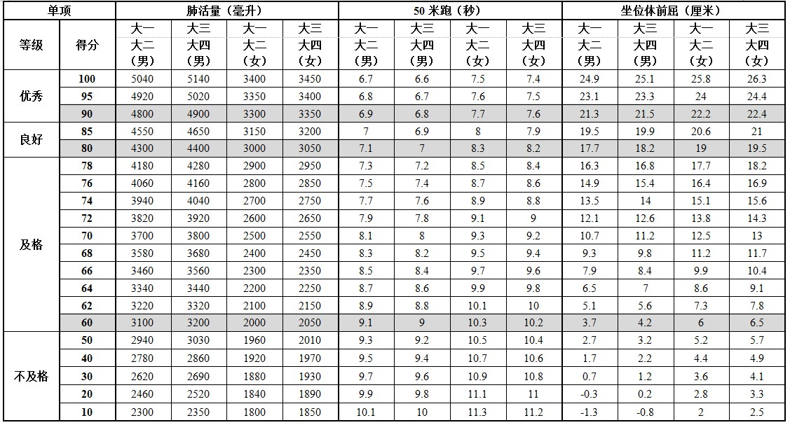

# 大学体育

上课的内容根据你选择的类型决定，具体看到时选课系统给的科目。一般来说选哪个时段的体育课会在选课前通知，其他时段的体育课就别去管了，与现有课程冲突的也选不上

强调：**不熟悉的球类运动慎选！** 考试体验极差这件事我已经在选了羽毛球、排球、篮球的同学口中听到过，头铁的你将较容易获得六七十分的成绩，建议熟悉什么选什么，再不济像我一样选**男子健身(女生的是形体)** 也可以，考试考俯卧撑跟波比跳(适合我这种啥也不会的)

课程上学期的重点在于**体测**：大学生体测包括**身高、体重、肺活量、坐位体前屈、立定跳远、引体向上(♂)、仰卧起坐(♀)**，以及在体育课上会先测试掉的**50m跑和1000m/800m跑**，这个部分似乎大概应该是会计入本学期的期末成绩，所以太久没锻炼的同学记得去备战中长跑和短跑，剩余项目学校会统一组织在体育馆和操场进行测试，具体听通知安排，体测**单科不及格**不要紧，**整体及格**了就行

**关于体测：**

| 单项指标      | 权重(%) |
| --------- | ----- |
| 体重指数(BMI) | 15    |
| 肺活量       | 15    |
| 50米跑      | 20    |
| 立定跳远      | 10    |
| 坐位体前屈     | 10    |
| 引体向上/仰卧起坐 | 10    |
| 800/1000米 | 20    |

BMI计算公式：$$\mathrm{BMI} = 体重(\mathrm{kg})\div身高^2(\mathrm{m})$$

| 等级  | 得分  | 男生         | 女生         |
| --- | --- | ---------- | ---------- |
| 正常  | 100 | 17.9\~23.9 | 17.2\~23.9 |
| 低体重 | 80  | ≤17.8      | ≤17.1      |
| 超重  | 80  | 24.0\~27.9 | 24.0\~27.9 |
| 肥胖  | 60  | ≥28.0      | ≥28.0      |

其他项目评分表：

<figure><figcaption></figcaption></figure>

<figure><figcaption></figcaption></figure>

<figure><figcaption></figcaption></figure>

课程的中期可能会叫大家写一篇**体育论文**，主题待定，老师可能会给一个范例，期末考试内容视运动类型而定