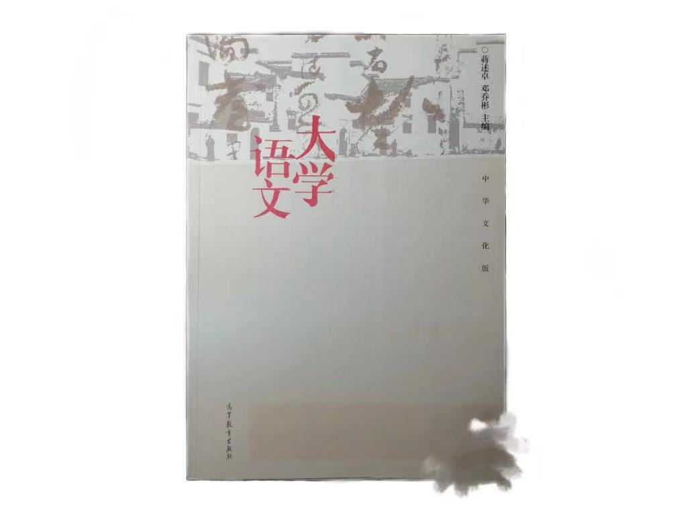

# 大学语文

**超级大水课**，有的老师甚至连名都不点，~~只要你**胆子够大**，理论上上课16周你只需去**3周**即可~~，中期有一次论文作业，要求是根据给出的书目(在学期初由老师给出)写一篇不少于**1500字的分析论文**，教材不一定需要买(只有复习时有用，但用处也不大)，最后一次上课老师会**直接划重点**，重点内容能在课本里摘抄下来(课本就这个时候有用)，同样的，大学语文也是有很多教学班的课程，期末的时候不同班的同学可以交流重点内容

附上课本正面的样子(网图，我没有这本书)

<figure><figcaption>
大学语文用书
</figcaption></figure>

我得到了一份2021年和一份2019年的版本：[21年的](https://pan.baidu.com/s/1nRhhneSeatHg99CsRifOqQ) 提取码: 2r9r，[19年的](https://pan.baidu.com/s/1qmaEUpLkXBJ48SvjkLHq7A) 提取码：d4ox

自己根据上一年老师给的重点整理的一份资料(作文部分不用看)：[下载链接](https://pan.baidu.com/s/1\_B4gfRTcvBV8-f88AqLPzg) 提取码：g9xf
