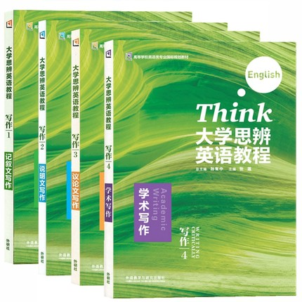

# 英语读写Ⅰ&Ⅱ

课程用到的书本如下，上下学期共用**前3本**(学术写作不用)

<figure><figcaption>
英语读写用书
</figcaption></figure>

上课摸鱼也行，认真听讲也可以，作业几乎每节都会布置，但检查的要求不高。这种课程主要的目的还是让大家适应全英授课的环境以及多认识点词汇而已，跟高中的英语课差距不是很大，而且**英语老师的英语口语当然是最好的**，好听又好懂，很适合练习英语听力

这门课程的考试**时间比较赶**，**1h50min**的时间要大家完成：

* 本学期课本内学到的**知识点名词**对应一些句子的对号入座选择/填空
* **2或？3**篇高考英语的阅读理解题(给一篇文章然后出3、4道文意理解的选择题)
* **250**词以上的作文一篇(我两个学期都没写完过)

虽然考试体验差，但是给分并不会大跳水，很多人还是能拿到80+甚至90分的，他考任他考，考试时**不要**因为太紧张做不完**破防**就行了

❗ 这里额外提一下关于**CET-4**(大学英语四级考试)，暨大开放给新生报名的时间是**大一下学期**，即大一上学期大家是不能报考CET-4的，而如果缺少英语练习，也许高考那一刻就可能成为你英语水平的**巅峰时刻**，推荐是手机里装个能**背单词**的app(百词斩、多邻国、不背单词之类的)，每天搞十几、几十个词，把四级的词汇刷足了，到下学期考前整一两套模拟卷子**熟悉一下题型**再参加考试
