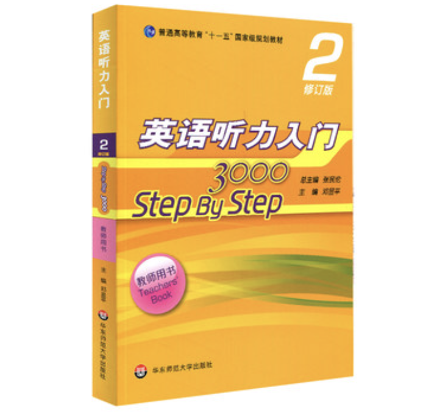

# 英语听说Ⅰ

课本用的是这本(淘宝上的图，跟我用的老版本长的有点不一样)

<figure><figcaption>
英语听说用书
</figcaption></figure>

只用这本黄色第二册的，但这本书**无法白嫖师兄师姐**的，因为她会叫大家搞一本全新书，每节课后完成一章后面的全部题目(难度偏高，什么花里胡哨的听力材料都有)，上课的时候会随机检查大家的完成情况并登记，上课时也会进行练习(在听力机房上课，座位固定，不能逃课)，放一个[听力材料链接](http://www.kekenet.com/Article/15414/)，里面也有听力的原文材料(想抄答案也可以，谁没补过作业呢)

同时这门课程会叫大家**做presentation**，挑选上书中的指定主题让大家自由发挥做一次演讲，**全程脱稿**，建议接到任务马上写稿，然后开始每天背诵背到下一节课上台，然后期末前还会再做一次pre，这部分的表现会**计入期末评价**

还有期末的笔试考试，上机听听力材料，材料一部分出自上述的课本课后题(就有可能是你做过的题，所以平时做作业的时候**多留意一下**)，一部分会扒一套**四级听力**的题目下来，还有一部分扒了**雅思**的听力材料。具体的类型会在考前让大家见识一下的，四级听力在上课过程中也会放几套给大家练习，后期甚至会把四级听力放进作业清单里面

规规矩矩完成作业跟pre，期末考试体验一般但拿**90分**不是什么问题
