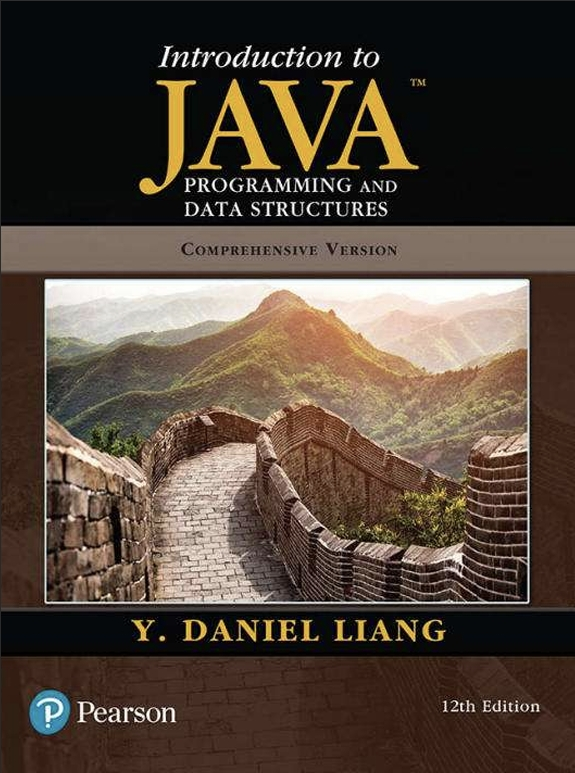
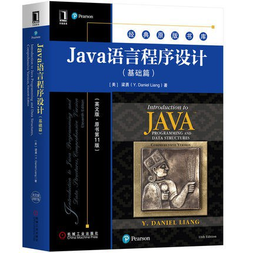

# Java程序设计(全英)

这门课程在大二下期间算是比较轻松的一门，算是让大家认识**面向对象编程**（Object Oriented Programming/OOP）的入门课程，但老师会从基本语法教起，早期课程教的Java的基本语法和C大差不差，有点上复习课的感觉，但是老师会经常问大家会不会讲得太慢，只要你C语言好好学前几周的课基本是不用听的，你们可以提议让她教快一点，整个课程大概分三个大部分：

* 基本面向过程编程语法（和C没多大区别）
* 面向对象编程语法（类、属性、对象实例、继承等内容，但在语法上只是多了几个关键字而已）
* 简单的GUI编程（用JavaFX框架实现一些图形内容，不过似乎有点过时了，没多少人做这样的开发【）

对于有选实验课的同学，这个课的实验强度比C语言的大一些，每次上课要完成**五个左右的程序编写**（当然在2024年GPT之类的AI助手肯定咔咔秒，但任务基本不涉及算法内容，绝大部分是语法练习，所以还是建议自己搓一搓熟悉一下），实验报告还是比较简单，写上每个问题、代码实现，后期面向对象时还要画UML图、bug与修复（~~她说没有那就自己编一个~~）这三个部分就行，**实验课偶尔考勤**，理论课不考勤

实验课布置的题目来自教科书_Introduction to Java Programming and Data Structures_，不过老师没有提供电子版，需要的话可以dd我或者去zlib等平台上找

<figure><figcaption>
电子版教材
</figcaption></figure>

我当时用的是第12版的书，但老师拿的是11版的（但是电子版的11版和纸质版的不一样，纸质版的11版和电子版的12版似乎是一样的）

<figure><figcaption>
纸质版教材
</figcaption></figure>

这门课程没有考试，理论课会有一个类似C语言课的Quiz在老师提供的网站上，自己完成并截图保存数据到一个课程报告里（老师会给样例），最后课程报告作为期末成绩评判标准

这门课有结课的大作业，我们当时的大作业为**修改项目代码让它跑起来**并写下运行效果与自己的改动，比较好的一个**抄大作业入门课**（老师确实是要求改代码而不是平地起大楼），对大三的课程有承上启下的启蒙作用，总之课程强度不高，可放心使用
