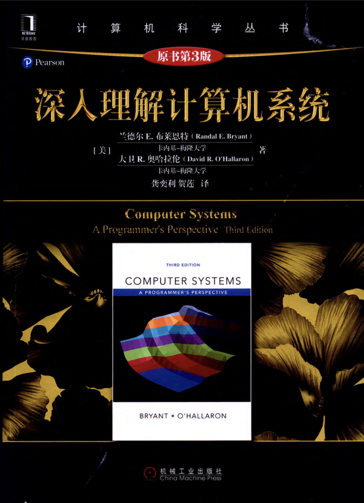

# 计算机组成原理(全英)

四大件硬课入门，某种程度上说，计组是导论plus，本课程的用书是Computer Systems: A Programmer's Perspective(CS:APP)，属于黑皮书里不管是内容、评价、配套练习之类都是第一梯队的好书，书中的序页里也提到，本书可以适用于不同培养课程的教学，它既可以被用作计算机导论的课本也可以被用作计算机组成原理的课本，我们的课程是以Computer Organization作为导向，教了1-6以及9-11章的内容

<figure><figcaption>
最受好评の黑皮肌肉计科书
</figcaption></figure>

不出意外的话22级CST依然是由孙教授教学，Prof. Sun已经教了这门课很多年了，在他的教学下，本课程是我大二上期间唯一一门靠上课听讲听的比较有收获的课【，而且课程量不大，22年他放过我们不少假，但他的上课状态是很不错的，他属于十分想让我们听懂这门课的知识点，导致他会在面对我们confusing的脸的时候非常着急地用中文再努力解释一下，有点搞笑但感觉很用心了

<figure><figcaption></figcaption></figure>

考勤的话，这门课的偶尔进行考勤，叫大家在下课前做几道书上的题并现场交上去（写在纸上），老师并不对这个进行记分应该，只是当作考勤用

因此这门课其实课程量不大，但是内容还是需要花心思理解一下，计算机的四大专业课到我写这段文字的时候我已经上了三门，关于计组和操作系统都是计算机概念理解居多，本身涉及到的数学算法倒是并不难，它们已经被抽象成简单的模型，也算是这门课考察内容的一部分。如果你觉得你对课上的内容依然不甚理解，可以试试B站上这个Up制作的[一系列视频](https://www.bilibili.com/video/BV1cD4y1D7uR/?share_source=copy_web&vd_source=2e2bcfa887bf8da9bde84af9fe79f8eb)，当然，直接啃书也是可行的，而到23年写下这段文字的时候，相信使用各类大模型工具（GPT、New Bing等等）也是一个帮你理解知识的好办法

这门课在其他更有实力的高校中的Lab课程是很有挑战性的，你也可以去CMU的这门课：[CS 15-213](http://csapp.cs.cmu.edu/3e/labs.html)中看看这门课程的开创者给出的Lab题目内容，其中的每个问题都是很有挑战性的。而在小小JNU，我们的Lab内容相对简单，有些内容从让你解决某个问题改成了让你解释这种解法的形式，变成了较无聊的堆工作量任务，因此边摸鱼边处理是可以接受的。and请注意，在大概是Lab3解释y86模拟器的任务中，使用非x86处理器架构电脑的同学可能会遇到要去借电脑或者是使用机房电脑完成Lab的情况（说的就是买了2020年后用M1及以后推出ARM芯片的MacBook）

最后，我来放一些资料啦，我们21级在22年末赶上疫情回家，从闭卷考试改成了论文结课，这门课我没有相应的考试资料，但是Prof. Sun教了很多届CST的这门课，也许你们在20级或更早的前辈那里可以要到一些考试的信息

影印版的中文黑皮书：[下载链接](https://pan.baidu.com/s/1r4CN-jJpwO7ULoKWong1Pw) 提取码: z6zw

电子版的英文书：[下载链接](https://pan.baidu.com/s/1pcRIT6Wq94CGLTGo7O4MHw) 提取码: qfih

课件（PPT）：[下载链接](https://pan.baidu.com/s/1D-z0-t_u9TqBS5OJEkA_6A) 提取码: j7dp

有兴趣先看看Lab内容的：[下载链接](https://pan.baidu.com/s/1FwwK7NNTmvyKnFELqKyqwQ) 提取码: 3p3y