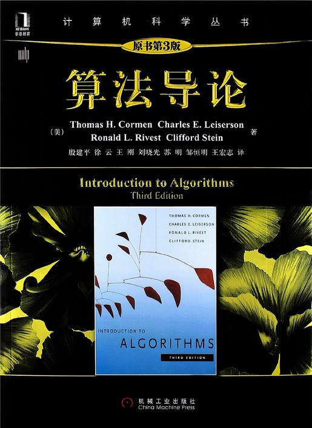

# 算法设计与分析(全英)

这课应该是大二下最难搞的课，有的同学如果接触ACM/ICPC赛事的话可能听过《算法导论》/_Introduction to Algorithm_这本书的的鼎鼎大名，这门课程就是用的这本玩意来做教材，中文版本的书也是黑皮砖头之一，生啃难度非常大

<figure><figcaption>
最抽象の黑皮肌肉计科书
</figcaption></figure>

不过课程内容不会完全把这本书的内容教完，相关的PPT老师会发给大家，由于她发得比较慢我把当时所有的PPT都上传至[课程汇总仓库](https://github.com/H3Art-q/JNU-IS-CST-Courses/tree/main/Design%20and%20Analysis%20of%20Algorithm%20%E7%AE%97%E6%B3%95%E5%88%86%E6%9E%90%E4%B8%8E%E8%AE%BE%E8%AE%A1)了

点评一下PPT：感觉很糊弄，很多地方老师直接截图贴在上面，而且这门课会涉及比较多数学表达式（不需要算结果，一般要求的是**算复杂度**或者**描述算法流程**），但这些全是图片，学过markdown/LaTeX数学公式语法的同学应该知道怎么敲出来，但是直接复制粘贴是别想了，总之是非常敷衍的PPT

与此同时，老师上课也讲得比较催眠，靠课程提供的内容，无论是自学还是听课都不容易学好，不过老师基本**不点名**（大三上补充，另一门课完全没有考勤分），**没有测验**，只有**两次HW**，自从20级非常低分（似乎70多80分算多）后老师似乎比较想把我们捞起来，于是在21级的时候拿80分往上不会太难了

关于如何自学，这课不需要很勤刷编程算法题，但可以根据对应章节去看看网课内容，这课的内容包含在[MIT 6.006](https://www.bilibili.com/video/BV1fu41127MN/?share\_source=copy\_web\&vd\_source=2e2bcfa887bf8da9bde84af9fe79f8eb)中，与北大公开课[算法设计与分析](https://www.bilibili.com/video/BV1Ls411W7PB/?share\_source=copy\_web\&vd\_source=2e2bcfa887bf8da9bde84af9fe79f8eb)有大量重合部分

最后，在结课前老师应该会给一点模拟题型，但那些基本不会在正式考试中再次出现（她自己说的），所有考试内容均出自PPT（书本内容帮助理解，复习的时候啃PPT就行），不过会有一点点算法描述题考点思维，自此CST完全进入**背多分**教学
