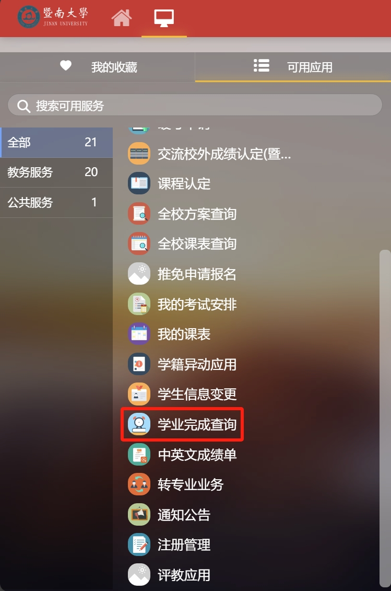

# 0x08😱大三课程

大伙看到这会也算个高年级学生了（老油条），但本专业会在大三上把强度上到最高，请做好心理准备，大三下稍微轻松一些，但那个点估计也在各忙出路了，所以课业强度下降不见得总体强度下降😭

对于大三上课程，有多门课程是需要完成课程项目的，有甚者又要项目又要考试，也有某些课程Lab+考试，然后你就会发现从期中过后事情就干不完了。对于大三下课程，所有的课程应该都是以选修形式开设，但为了毕业学分要求这些选修课程对大伙来说几乎都是必修，不过22级以后的培养方案似乎和我们的有所出入，需要自己去对照研究选课。

<figure><figcaption>
也可以从教务系统的学业完成查询里去算自己差多少分够毕业
</figcaption></figure>

关于如何在大三这个强度中生存下去，我有几个建议：

* 首先经过大二的Java和SE课程，你也许发现了，在Github上有很多开源的项目，不止[JNU-IS-CST-Courses](https://github.com/H3Art-q/JNU-IS-CST-Courses)，利用这些开源资源可以让你更轻松地应对一些课程要求
* 所有课程的难度（难度 != 强度）都不是很过分，不再有很过分的数理课程，跟数理沾边的可以背多分。其他课程最低要求把项目完成，把报告交上去，老师在给分上不是很为难高年级学生（好过 != 好高分）
* 想拿高分的课程项目基本上不可能从头造了，你需要把第一点内容发扬光大（这似乎不是什么好事，但他们不管）
  * 写好报告对拿分来说挺重要的，但一般来说老师很少给报告的打分标准（我会出手👋），专业课的presentation没有多高要求，拿个稿子上去念是没问题的
* 关于想要争取推免的同学，你的必修课必须按计划修读，但选修课不一定需要当年修读，所以可以考虑在参照毕业学分要求后，把一些选修课推到大四再选
  * 对于想境外升学的同学，因为申请季一般是大三结束后，所以你完全可以把不好拿分的课程丢到大四，保住你的GPA
* 对于参加内地高校保研夏令营的同学，你可以考虑冲一些大三下在第12周以前结课的高分课程，那些夏令营一般只要前5学期或报名时的成绩（大三下还没结束），争个好RANK好让他们要你（被酒吧💃大学k麻了的人如是建议）

总之，大三给我的感觉就是正经的东西没学多少，但是忙完这些课程已经足够让人筋疲力尽，还要想着毕业出路，希望大家把握好自己的方向吧
