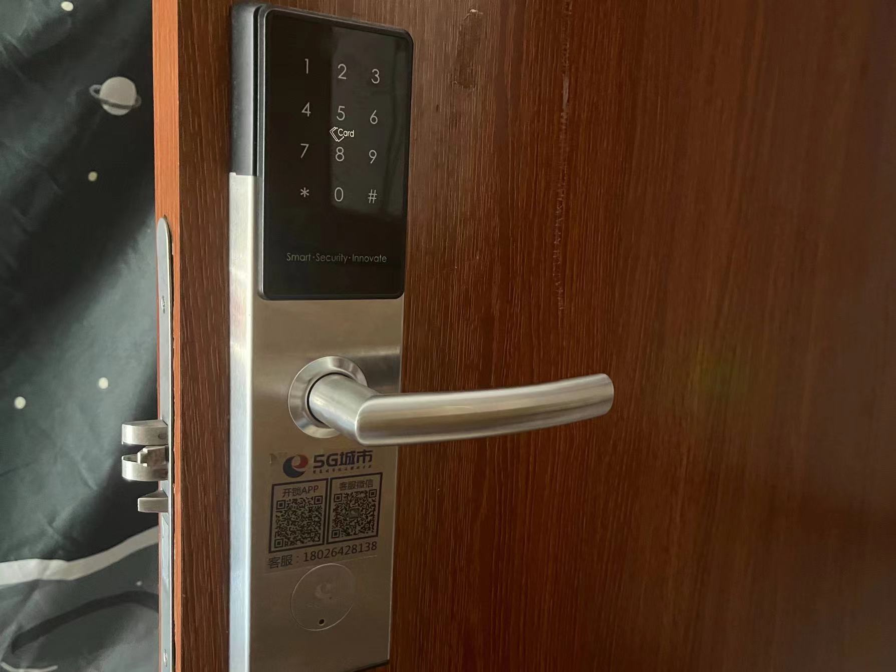
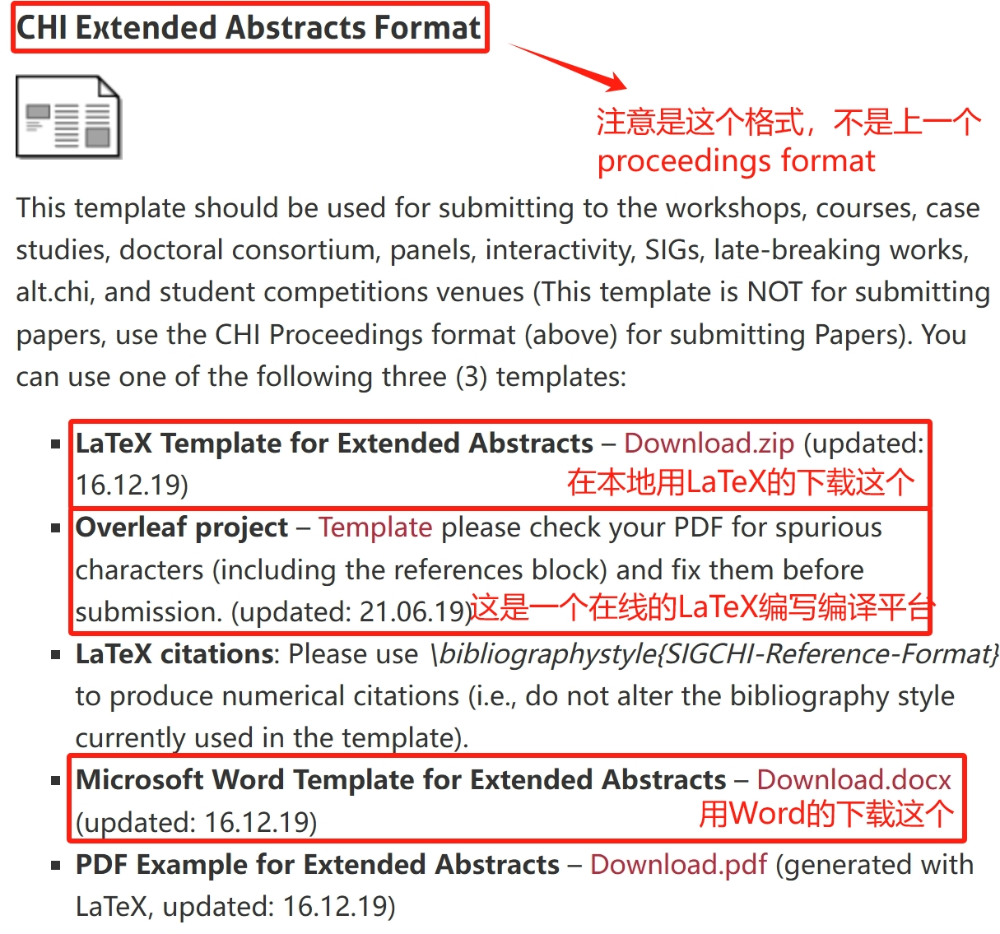

# 人机交互(全英)

作为一门只开10周的课程，这个工科中的文科只能说算个茶余饭后的消遣，真的对HCI（Human-Computer Interaction）感兴趣的人也不能靠这几周完成入门。在课表上，这玩意似乎是标注为三节课，不过正常来说都是听两节课吹水后直接下班

<figure><figcaption>
应该不会有人觉得这玩意是好的HCI设计【
</figcaption></figure>

授课教师和数据库系统的授课教师是一伙的，在此课程中点名考勤也偶尔作为增加课堂长度之举，属实是没啥能讲的东西了。顺带一提，他们两个在信科院也各自开设一个班的人机交互课程，和我们这边的内容基本一致，但他们的作业布置是有连贯性的，最终会把几个作业凑在一起完成最终的项目报告，进度比CST稍快，可以去找他们参考

关于课程内容，大致参照大二SE的上课状态，不过这门课没有笔试考核，最终是以项目报告的方式作为考核，没有个人汇报环节。除此之外，作业完全就是他想到什么布置什么，一般都是写个小报告上交，但全部都是发给TA（教授基本不可能自己批作业），所以这个部分的给分是没有任何标准可言的，完全不透明

最终的结课项目没有框定主题，只要是个跟人机交互有关的项目都行，这边的课程要求提供源代码，信科院那边没有要求，只要求写一个报告，但是是一样的老师，所以是CST要求更高（确信）。老师那边有模板要求，用的ACM CHI会议的一个论文模板（docx版和TeX版均有），在要求中他会提供[下载链接](https://chi2020.acm.org/authors/chi-proceedings-format/)给大家，不过有部分同学可能没接触过科研论文这部分内容，以下做简单说明：

<figure><figcaption>
中间那个Overleaf模板点开了就直接在那个平台里编写
</figcaption></figure>

> 提示：你完全可将报告里的人机交互项目写得天花乱坠（当然配图要跟得上，怎么获得好的配图这里不多展开），因为那个提交上去的源代码根本不会被运行
>
>
>
> 根据提示推理：大部分叫你交源代码的项目老师都不会管你的代码到底能不能跑

很显然，这个结课项目和报告也没有任何打分标准，极大概率也是研究生TA打分，给分是玄学但不算太低
