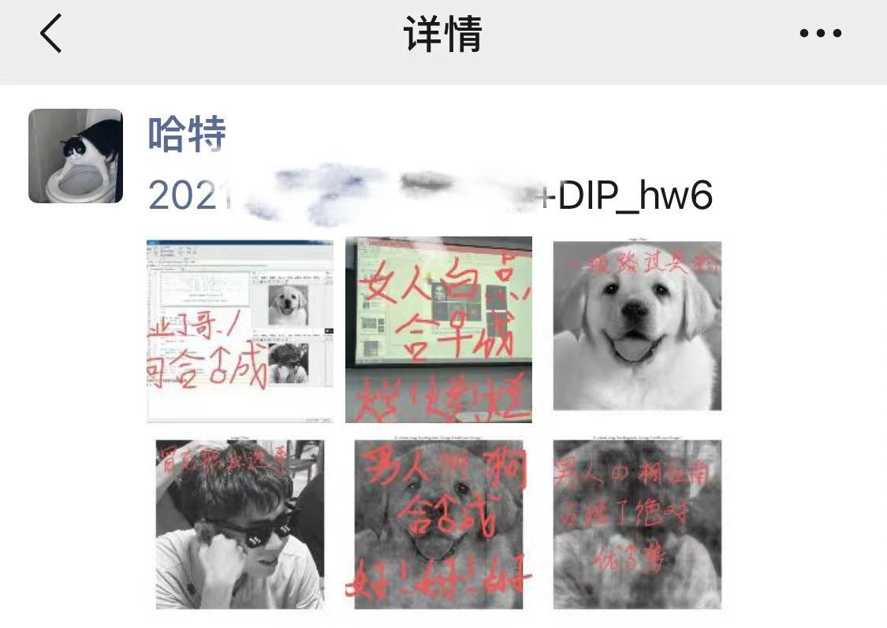

# 数字图像处理(全英)

这课老师挺好说话的，而且一上来就让班内集体表决考核方式：期末考试/项目+报告，20和21级都选择了项目+报告，19级似乎是选择了考试，据说考试是给个提纲背多分，项目+报告和机器学习课程类似，但也可以不做项目的报告，具体要求详见21级的[JNU-IS-CST-Courses](https://github.com/H3Art-q/JNU-IS-CST-Courses/blob/main/Digital%20Image%20Processing%20%E6%95%B0%E5%AD%97%E5%9B%BE%E5%83%8F%E5%A4%84%E7%90%86/Bonus/Course%20Report%20requirement.pdf)或等新一学期老师发布

课程内容上，老师会想要一名课代表帮他考勤和收作业，第一节课提到的时候直接举手，反正在老师面前刷存在感的工作量没增加多少，后面他眼熟你多给你两分倒是挺容易的（但他其实会说“对分数有要求的同学可以来找他说明一下”，懂的都懂哈）

课程的具体内容就是讲一些图像的处理，对准备跳进CV（Computer Vision）坑的同学来说，这算是在讲一些图像特征的预处理过程吧，有涉及一点数理知识（like咱高数没提的傅里叶变换），但他不会讲深，如果大伙选的是项目结课的话也不是很重要，有兴趣的可以听听

配套的Lab比较简单，不过要用MATLAB（推荐个神奇的小网站，可以上[这](https://www.52pojie.cn/)找下载），咱专业绝大多数人也是第一次碰这玩意，不过其实所有内容都挺简单的，各种AI Copilot都能秒杀Lab的题目。他没有给一个很确切的排版要求，图片的排整齐一点，代码可以用各种格式化工具（直接贴VS Code里/[代码在线高亮工具](https://highlightcode.com/)等等）来让排版看起来好看点，不过其实他也不是很看重这些，似乎图贴得多报告写得长就分给得高，但Lab普遍没几个学分，不用在这些东西上抠细节

这课比较好玩的点是在理论课上，老师会布置一些莫名其妙的作业（也许22级/23级的同学看到过本人在朋友圈发送一些奇怪的内容），具体就是让你用MATLAB做一些小实验然后把图片发朋友圈让课代表和老师自个验收，而且经常是用一些自己的照片去做HW素材，引发一些其他专业对CST的小小震撼，不过验收并不是很严格，验收一般只让课代表自己登记

<figure><figcaption>
人狗合♂成
</figcaption></figure>

最终的考核还是比较轻松的，选择期末考试据说背多分后分数给的还是不错的，而项目+报告跟机器学习课程的项目可以互用，前提是你做CV相关的机器学习项目，看各位选择

如果你直接用机器学习的项目来套这边的项目和报告的话，经本人亲测，搞CV在老师那是比较讨喜的，具体体现在给分不错，能拿95+（虽然但是我亲测的是不搞CV，做别的的图像处理项目，拿94），但是不清楚会不会大家全卷CV让他审稿疲劳，总之跟他混熟了分应该就不会低

最后，老师是一个比较注意“沟通得体”这件事的人，他经常上课扯一些关于他的研究生或者说他带过的学生在交流沟通方面的不得体现象🤓，具体表现在各种不打招呼，邮件直接丢文件不另加说明，缺少书信格式等等事情上。我觉得在邮件书信这事情上还挺重要的，因为后面各种交作业、申请季都有邮件提交的要求，所以建议各位提前熟悉一下（拿Copilot帮你生成一个模板再自己改改）
