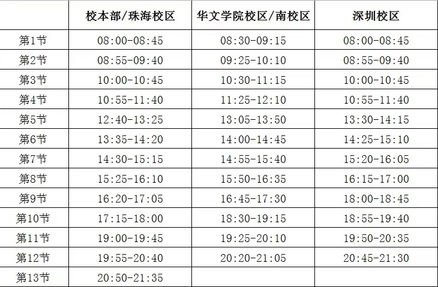

# 杂项强调

* 微信中将通知群**置顶**，记得查看微信通知，大学中有很多作业通知和一些非必要但有用的活动发布、获奖申请等信息漏了的话，其他同学没有义务再提醒你了
* 有言是“**宿舍是时间的黑洞**”，如果你的宿舍不是那种五人同心的默契模范宿舍(_参考暨大公众号上的各种全员保研考研上岸神仙宿舍_)，那么请你**多 走 出 宿 舍**，不要在宿舍里被温水煮青蛙，在宿舍睡一觉一个上午/下午就快结束了是常有的事情，请**珍惜自己的时间**，干点正事(_认真_)
* 注意我们的上下课时间

<figure><figcaption>
课程时间表
</figcaption></figure>

* **番禺校区**记住几个时间点
  * 早八上课：**8:30**， 早八下课：**10:10**
  * 早十上课：**10:30**， 早十下课：**12:10**
  * 下午上课(_以连上3节为标准_)：**14:00**(_午休时间很短_)
  * 下午下课(_同上_)：**16:35**(_这个点已经**点不了**校内配送上楼的外卖了_)
  * 晚课上课(_以连上3节为标准_)：**18:30**(_意味着你5点左右就最好解决晚饭_)
  * 晚课下课(_同上_)：**21:05**(_美美回寝洗漱躺平_)
* 如果你想骑车进入大学城，要么绕到大学城北部才有自行车的通路，要么搭乘在新造镇的**轮渡班次**，一次1￥但需带**现金cash❗**(_我也不明白为什么这年头还有不能用微信支付的消费场所_)，广州市区基本上**所有的大桥与隧道都禁止非机动车**通行
* 要去新造地铁站的话**南门出门右拐**有绿色的如约小巴，专门跑暨大南门跟新造站的(_但回程可以在东门下车_)，一趟**3圆**(_和校车来回本部南校一个价_😥)，但还是比直接打车便宜
* 小问题**校医室**，中问题**新造医院**，中等偏上问题**南村医院**(_比如被猫猫抓了要打狂犬疫苗_)，大问题找**三甲医院**(_三甲医院是统称哈不是地名不是地名不是地名_)
* 如果在**教学楼**有东西丢失了可以关注**平安暨南番禺校区**，公众号每隔一段时间就会发布一些失物认领公告，失物领取地点在教学楼进入**正门右转的120室**，如果没找到也可以再去教学楼进入**正门左转的130室**问问看，这两个办公室都有负责失物的管理
* 宿舍有门禁制度：
  * 周日至周四：23:30 - 次日6:00
  * 周五与周六：0:00 - 次日6:00 在门禁时间内回宿舍会被记**夜归**，一个月被记录**3次及以上**会被约谈
* 暨大的无线网络购买方案建议**按月买**，因为寒假暑假不在校，如果要用手机加电脑就买多出口，反之单设备单出口。对网络速度有要求的同学建议买根网线在宿舍捅电脑上，暨大有线网络的传输速度与无线网络的传输速度**差距极大**：有线最高可以跑到**60MB/s**左右，无线才约**2MB/s**
* 如果有打印一些资料的需求，我推荐大家先把要打印的文件转为**pdf格式**再打印pdf格式下的文件，**pdf格式**能保证你在什么平台上打开后排版格式都不会变形，如果你是一个office和WPS混用的用户你会很快明白这件事存在的必要性
* 如果你和我一样出门坐地铁不看导航规划，这里贴一张广州地铁线路图

<figure><figcaption></figcaption></figure>
